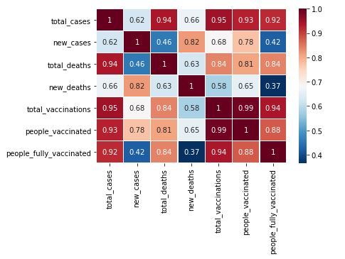
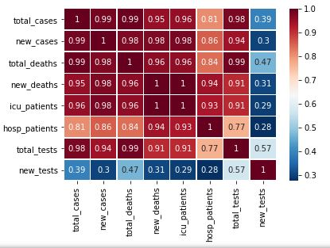
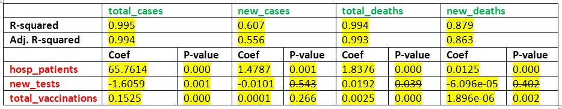

# 
  2021_Spring_finals
## COVID-19 Pandemic: Examining Its General Effects, Intensity & Vaccination
## IS 597: Progr Analytics & Data Process (Type II Project)
### 
  By Malik Salami

  

### Project Description:

 The aim of this project is to get an insight from the world COVID-19 dataset through inferential analysis to measure the degree of relationship between various COVID-19 variables/factors - considering its general effects, intensity, and vaccination - to know its contribution towards reduction of its effects. 
The study performs further analysis (multiple regression analysis) to understand how some of the COVID-19 variables predict one another. 

### Data Source:
This is secondary data that was collected from Our World in Data
https://ourworldindata.org/covid-vaccinations

Their primary source of data are from different countries, organizations, etc.
https://ourworldindata.org/covid-vaccinations#source-information-country-by-country

### Data Set:
For testing of the two hypotheses, only 16 countries (as at the time of data collection) met our variable of interest. The countries are:
'Austria', 'Belgium', 'Bulgaria', 'Canada', 'Cyprus', 'Denmark', 'Estonia', 'Finland', 'Ireland', 'Israel', 'Italy', 'Luxembourg', 'Portugal', 'Slovenia', 'United Kingdom', 'United States'.

For the Multiple Regression Analysis (MRS), the independent variables were scrutized for suitability for the test. Only three variables: 'hosp_patients', 'new_tests', and 'total_vaccinations' were satisfied the MRS condition and were used as predicator variables for the COVID-19 General Effect (independent) variables. Therefore the raw data were re-assessed for analysis thus an additional 11 countries were included for the MRS. The countries are:
'Lithuania', 'Croatia', 'Czechia', 'Slovakia', 'Iceland', 'Sweden', 'Hungary', 'Latvia', 'France', 'Poland', 'Norway'.

### Variables Definition:
<ol> COVID-19 General Effect Variables: these are COVID-19 infection indicators that could to led to death. They are 
    'total_cases','new_cases', 'total_deaths','new_deaths'. </ol>
<ol> COVID-19 Preventive Variables: these are COVID-19  protective indicators. They are:
    'total_vaccinations', 'people_vaccinated', 'people_fully_vaccinated'.</ol>
<ol> COVID-19 Intensive Variables: these are COVID-19 infection indicators that led to hospital admission. They are: 'icu_patients', 'hosp_patients', 'total_tests', 'new_tests'. </ol>

### Hypotheses:
<ol> H1: There is no significant relationship between COVID-19 Preventive Variables and COVID-19 General Effect Variable.</ol>
<ol> H2: There is no significant relationship between COVID-19 Intensive Variables and COVID-19 General Effect Variable. </ol>

### Further Analysis:

 After Correlation analysis were conducted to test the above hypotheses, a futher analysis (multiple regression analysis) was conducted to identify the extend to which 
some qualified COVID-19 Intensive & Vaccination Variables (independent variables) were able to predict the COVID-19 General Effect Variables (dependent variables).

### Limitation
The limitations observed from the dataset are two:
1. Many of the countries in the dataset doesn't having their data filled up-to-date.
2. Many of the countries in the dataset doesn't have their records completed.
These two limitions caused this study low data-size. 

### Interpretation Guide:

 A value of ± 1 indicates a perfect degree of association between the two variables. As the correlation coefficient value goes towards 0, the relationship between the two variables will be weaker. The direction of the relationship is indicated by the sign of the coefficient; a + sign indicates a positive relationship and a – sign indicates a negative relationship. 

### Preliminary Conclusion:

  

There are strong indications in the above analysis that COVID-19 Prevention Variables and COVID-19 General Effect Variables are strongly related except for new cases and people_fully_vaccinated that is  0.421675; and new death and people_fully_vaccinated that is 0.365751, that are weakly correlated. Nevertheless, total_vaccinations have been strongly correlated all through.
Therefore, H1 is rejected which says:there is no significant relationship between COVID-19 Preventive Variables and COVID-19 General Effect Variable. 

There are strong indications in the above analysis that COVID-19 Intensity Variables and COVID-19 General Effect Variables are strongly related except for new cases and COVID-19 General Effect Variables that are weakly correlated. Nevertheless, total_vaccinations have been strongly correlated all through.
Therefore, H2 is rejected which says:there is no significant relationship between COVID-19 Intensitive Variables and COVID-19 General Effect Variable.

 <ol>total_cases:</ol>
The model is significant: having F-Statistics(1548), p < 0.0005.The model explains 99.4% of the variance (Adjusted R square = 0.994). According to the information on the model all the independent variables: hosp_patients, new_tests, and total_vaccination are significant predictors for total_cases.
 

 <ol>new_cases:</ol>
The model is significant: having F-Statistics(11.85), p < 0.0005.The model explains 60.7% of the variance (Adjusted R square = 0.556). According to the information on the model only total_vaccination is significant predictor for new_cases while hosp_patients and new_tests are not significants.

 <ol>total_cases:</ol>
The model is significant: having F-Statistics(1184), p < 0.0005.The model explains 99.4% of the variance (Adjusted R square = 0.993). According to the information on the model only hosp_patients and total_vaccination is significant predictors for total_cases while new_tests is not significant.

 <ol>new_deaths:</ol>
The model is significant: having F-Statistics(55.67), p < 0.0005.The model explains 87.9% of the variance (Adjusted R square = 0.863). According to the information on the model only hosp_patients and total_vaccination is significant predictors for new_deaths while new_tests is not significant.

